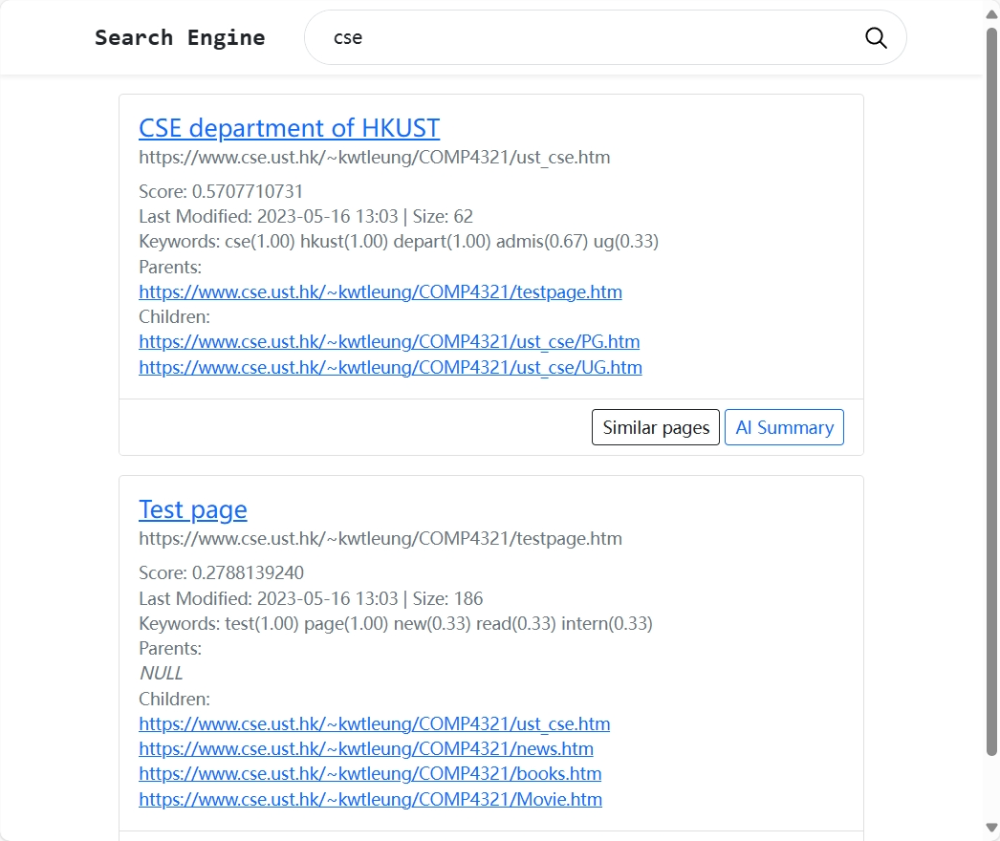
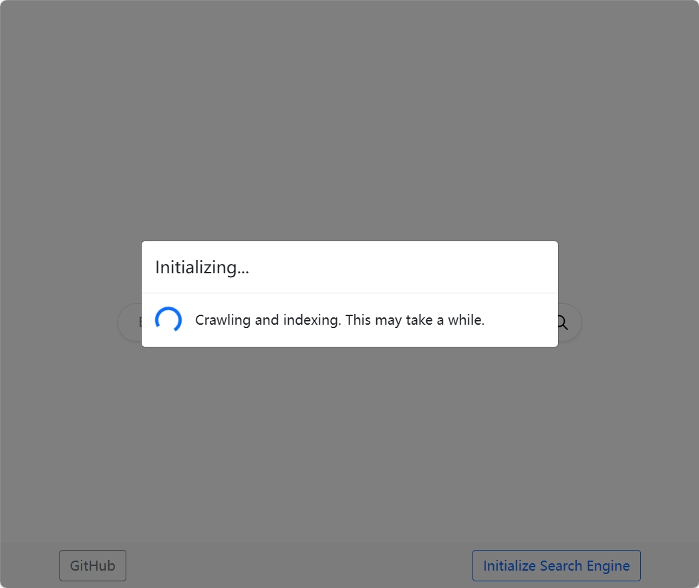
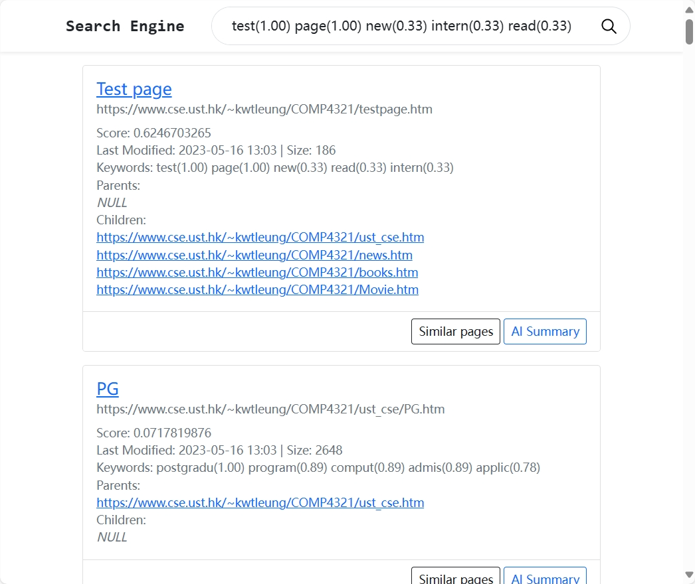
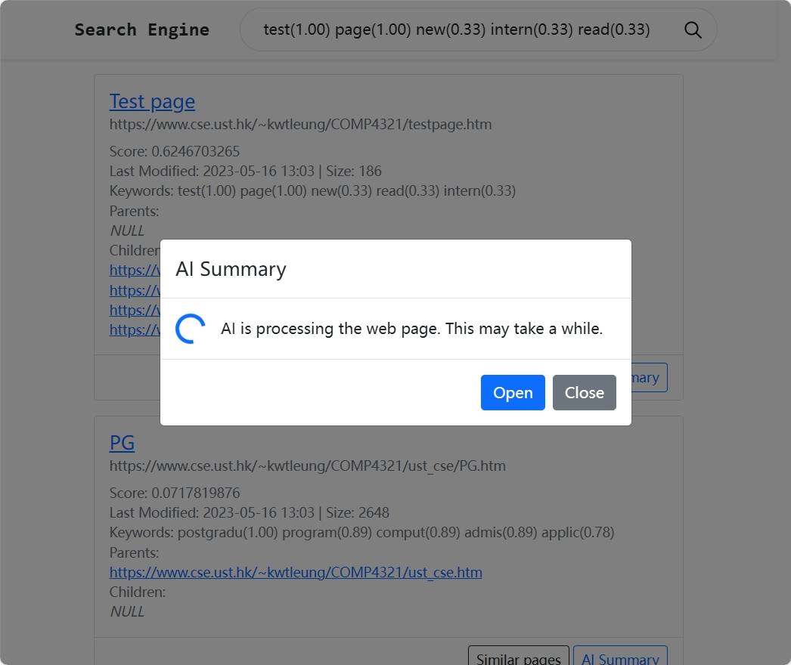
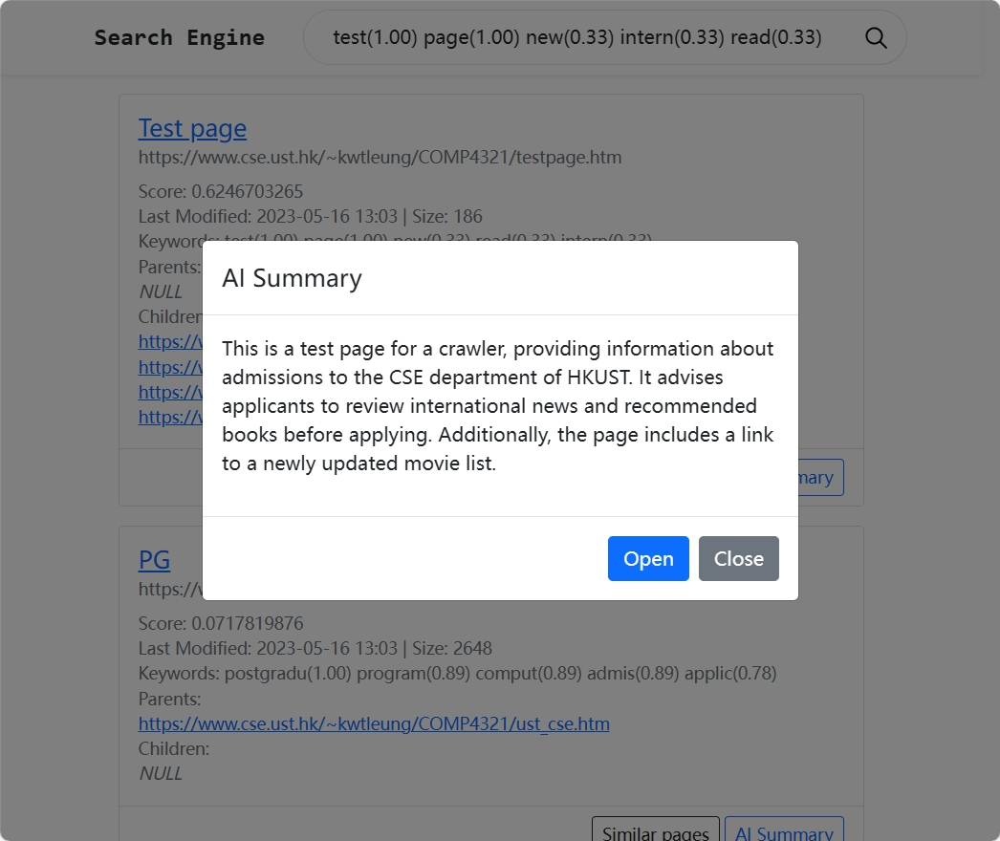

# Search Engine

## Getting started

1. Download or clone this [project](https://github.com/SilentNight1224/CSIT5930-Course-Project/tree/main)
2. Open the project in IntelliJ IDEA
3. Run the project
4. Access the website at [http://localhost:5930/](http://localhost:5930/)

- You may need to install the **Lombok** plugin and ensure it is enabled, along with ***Enable annotation processing***.
- Application entry point: `hk.ust.csit5930.seachengine.SeachEngineApplication#main`
- The package does not include the DeepSeek API Key we used. For details on using related features, please refer to the subsequent instructions.

## AI Summary Configuration

1. Create a file named `application-dev.properties` in the directory `src/main/resources/`
2. Edit the file and add the following configuration:  
   `spring.ai.openai.api-key=${API_KEY_HERE}`
3. Rebuild and rerun the project

## Additional Information

Unlisted Details from the Slides

### Favoring Title Matches

To give preference to title matches, we multiply the term frequency (TF) of words in the title by a coefficient during document TF calculation.  

This coefficient can be configured via `hk.ust.csit5930.seachengine.config.Config#INDEX_HEAD_TOKEN_WEIGHT`, with a default value of 2.  

For example, if the word *CSE* appears once in both the title and the content, its pre-normalized frequency will be 3 (1\*2 + 1).  

For details, refer to the logic implemented in `hk.ust.csit5930.seachengine.db.ForwardIndex#getNormalizedTF`.  

### Conclusion

#### Advantages

- Fast response times
- Simple and clean user interface
- Three enhanced functionalities

#### Disadvantages

- Preprocessing may lead to empty queries (e.g., when users search for terms like "*the*")
- Potential difficulty in handling scenarios with a large number of pages (hundreds of thousands or more)
- Search result relevance could be further improved

## Screenshots

 

 

 

 
